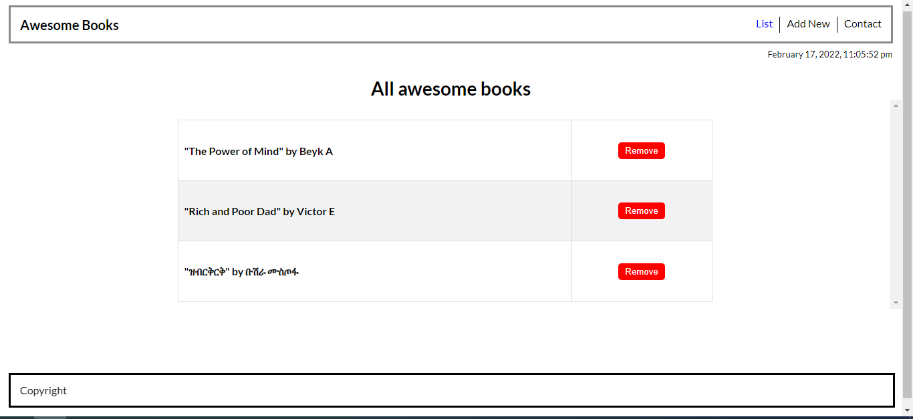

# awesome-books
This is a book shelve website dedicated to store collection of books, add new books and delete books. 

In this project, you will be using javascript arrays and object to store the list of books and saving the book colection in the local storage. Do not use any other framework, just pure javascript. After you are done with the project, run tests and deploy. 

## Built With

- HTML5, Javascript
- CSS3
- Linters

## Live Demo
**If you disable CORS, you can run using below**

[Live Demo Link](https://bushmusi.github.io/awesome-books-es6/)

## Getting Started
To get a local copy up and running follow these simple example steps.

## Prerequisites
- Have a good knowledge on how to parse UI designs
- Have VSCode or other text editor installed. [Link to download VSCode](https://code.visualstudio.com/download)
- Install node package. [Link to download node](https://nodejs.org/en/download/)
- Have git installed.[Link to download git](https://git-scm.com/downloads)
- Create a github repository.

## Setup
- `git clone https://github.com/bushmusi/awesome-books-es6.git`
- `cd awesome-books-es6/`
- `npm install`
- `npx parcel index.html`

-Follow the HTML-CSS linter confuguration to docs to setup linters [Link to Microverse linter docs](https://github.com/bushmusi/linters-config/tree/master/html-css-js)

## Run tests

For tracking linters errors locally, you need to follow these steps:
- For tracking linter errors in HTML file run:
`npx hint .`
- For tracking linter errors in CSS file run:
`npx stylelint "**/*.{css,scss}"`
- For tracking linter errors in Javascript file run:
`npx eslint .`

## Deployment

- Use GitHub pages to deploy website
- For more information about publishing sources, see [About github pages](https://pages.github.com/)

## Author

👤 **Victor, Bushra and Beyk**

- GitHub: 
    - [Bushra](www.github.com/bushmusi)

## 🤝 Contributing

Contributions, issues, and feature requests are welcome!

Feel free to check the [issues page](../../issues/).

## Show your support

Give a ⭐️ if you like this project!

## Acknowledgments

- Microverse 
- Coding Partners
- Code Reviewers

## 📝 License

This project is [MIT](./MIT.md) licensed.